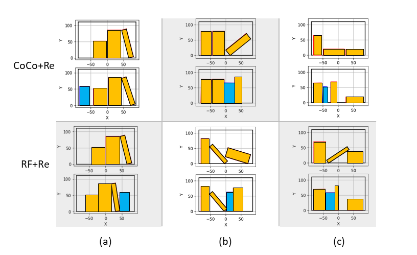

# ReDUCE
ReDUCE:  Reformulation  of  Mixed  Integer  Programs  using  Data  fromUnsupervised  Clusters  for  Learning  Efficient  Strategies

This repository contains code for [ReDUCE:  Reformulation  of  Mixed  Integer  Programs  using  Data  fromUnsupervised  Clusters  for  Learning  Efficient  Strategies](https://arxiv.org/abs/2110.00666) by Xuan Lin, Gabriel I. Fernandez, Dennis W. Hong

Construction ongoing.

To collect data, run:

``
python complete_pipeline.py
``

To train learning agents, use the jupyter notebook:

``
jupyter notebook book_problem_train.ipynb
``